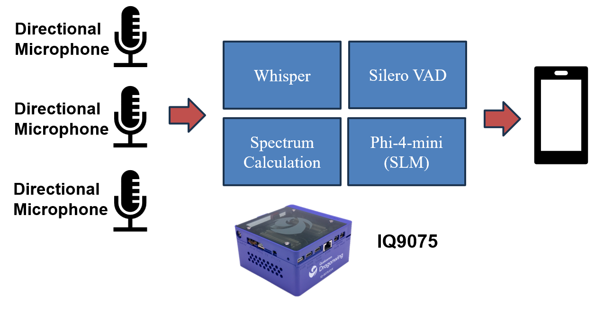

# Qualcomm IQ9075 Edge AI 2B Meeting Minutes System

## Advantages of IQ9075

1. IQ9075 can provide up to 100 TOPS of AI computing power and supports GPU and DSP accelerated computing
2. The Qualcomm Neural Processing (SNPE) SDK and the Qualcomm AI Engine Direct (QNN) can optimize the performance of trained neural networks
3. It supports Yocto and Ubuntu for AI development

## Performance Metrics

- **AI Model**:
  - VAD：Silero VAD
  - ASR：OpenAI Whisper large-v3-turbo (QNN)
  - SLM：Phi-4-Mini-Instruct (QNN)

## Hardware

- **Platform**: [Qualcomm IQ-9075 EVK](https://www.qualcomm.com/developer/hardware/qualcomm-iq-9075-evaluation-kit-evk)
- **Microphone**: Directional Microphone * 3

## Software & Toolkit

- **Qualcomm AI Runtime (QAIRT) SDK**：2.40.0.250424
- **System:** Android

## Background & Solution

### Motivation

In special 2B use cases (e.g., wearing masks in an operating room), multiple speakers participate in the operation simultaneously, failing to accurately track who spoke, when, and what was said leads to garbled or missing records, compromising their completeness and reliability

### Solution

Deploying a meeting minutes system that uses deep learning and spectrum computation to assign timestamps to every utterance, ensuring a high level of traceability and verifiability of meeting content

## Architecture Diagram

The IQ9075 2B Meeting Minutes system is designed to record voice conversations. Audio is captured by microphones and processed through the IQ9075. The processing pipeline includes spectrum analysis, VAD, Whisper, and an SLM to generate verbatim transcripts. Mobile devices can access and view the speech transcription and analysis results via BLE/Wi-Fi.

## Demo
https://github.com/user-attachments/assets/2d8fcde7-ec4a-4c77-a0df-e043208bfdc8

